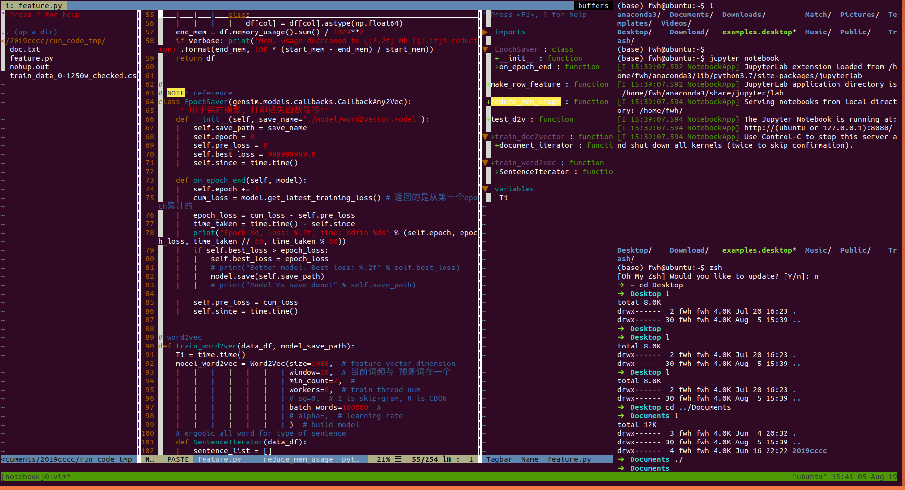

<div align=center><h1>DaiDai's dotfiles</h1></div>


### Introduction

**note**: Continuous updating!

`DaiDai's dotfiles` is a configuration file that creates a development environment with just one line of command.



### Feature

- vim plug-in manager tool is Vundle
- Support OS: Like-Unix (Ubuntu,MacOSX)
- install:
  - `zsh`, `tmux`, `vim`, `ssh`
  - linux shell tool:
    - `tree`
    - `autojumpy`

### Install

```shell
cd ~ && git clone -b tmp https://github.com/daidai21/dotfiles && cd ~/dotfiles && sudo install.sh
```


### Usage

`folder/`: not in `~/folder/`, this is a temp folder.

- `hosts`: in `/etc/`, config realm name and IP
- `apt.conf` in `/etc/apt/`, config global proxy

##### Zsh

```shell
zsh  # using oh-my-zsh
```

##### Tmux

- prefix key: `Ctrl + x`
- command
    - `tmux (new -s session_name -n window_name)`  create a new session
    - `tmux ^x d`  sign out and save
    - `tmux at (-t session_name)`  get into named tmp session
    - `tmux ls`  show all session_name
    - `tmux kill-session -t session_name`  kill tmp session
- window
  - `prefix n` next window
  - `prefix p` previous window
  - `prefix c` create a new window
  - `prefix ,` rename current window
- window pane
  - `prefix %`  vertical split
  - `prefix "`  horizontal split
  - `prefix z`  maximize pane / recovery
- `shift mouse-right` + `click copy` copy

##### vim

- `F9`  open / close small map
- `F2`  open / close catalog

- switch windows
  - `ctrl w direction`  switch widnows
- `:sp file_name`  upper and lower segmentation windows
- `:vs file_name`  horizontal segmentation
- switch file `buf`
  - `:bn`  next file
  - `:bp`  previous windows
  - `:bn`  switch to the `n`th files
  - `ctrl 6`  switch file
- switch window `tab`
  - `gt`  previous window
  - `gT`  next window
  - `:tabe file_name`  open a new window
  - `：tabc`  close windows

- `shift z z`  save file and fast quit
- just font size
  - `ctrl -` size small, `ctrl shift +` size big
- adjust windows size
  - vs windows
    - `F5` small, `F6` big
  - sp windows
    - `F7` small, `F8` big
- fast copy paste
  - `yy` fast copy one line
  - `p` fast paste one line
- auto complete
  - `ctrl p` open auto complete
- `ctrl s` stop screen output
- `ctrl q` recovery screen output

- `:set fileformat=unix` or `:set ff=unix` change windows file format to linux/mac file format.
- `:start_lines,end_lines>` indet
- `:start_lines,end_lines<` retract   `Ctrl + d`

- **Command mode**
  - `G` go file end
  - `gg` go file head
  - `dd` delete current line
  - `ndd`  delete from current line to n next line
  - `yy` copy current line
  - `nyy` copy from current line to n next line
  - `p` paste in next line
  - `P` paste in previous line
  - `u` return previous step
  - `ctrl r` return next step
  - `.` repeat previous operator
- **Last line mode**
  - `:n1,n2s/word1/word2/g` from n1 to n2 change word1 to word2
  - `:%s/word1/word2/g` change word1 to word2 in all file
- **block selection mode** `ctrl + v`
  - `shift + i`, input insert content, then `Esc Esc`
  - `d`, then `Esc Esc`

##### Other Tool

```shell
# auto jump
jc filename  # fast to appoint name file

# tree
tree filename  # see file tree

# avoid error rm -rf
trash

# (moss userid=662266874) check code repeat

```

- man manual
    - `man`
- cman manual chinese language
    - `cman`
### CopyRight

For learning only, all remaining rights reserved by individuals.`Github@daidai21`
